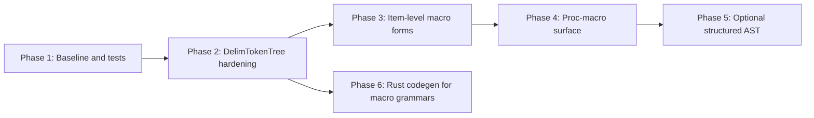

# Rust Macro Support — Implementation Plan

This document plans extensions to **Rust-as-a-language in CongoCC**: the `examples/rust` grammar and the internal `org.congocc.parser.rust` bootstrap copy (`src/grammars/RustInternal.ccc`). It does **not** cover:

- **RustFormatter** (source pretty-printing of `.rs` files)
- **CTL template macros** in `src/templates/rust/*.ctl`

---

## Current State

The Rust grammar already implements a **pragmatic, token-soup** model for macros. That is appropriate for parsing real `.rs` files and building an AST, but not for macro expansion.

| Area | Status |
|------|--------|
| `macro_rules! name { ... }` | `MacroRulesDefinition` / `MacroRulesDef` |
| `path!` / `try!` invocations | `MacroInvocation` + `DelimTokenTree` |
| Item- and stmt-level `...;` | `MacroInvocationSemi` (with `SCAN` for block context) |
| Attribute bodies `#[attr(...)]` | `AttrInput` → `DelimTokenTree` |
| Macro body tokens | `AnyToken` inside `DelimTokenTree` |
| Delimiter balancing | `INJECT PARSER_CLASS` fields + `ASSERT` / `SCAN` in `DelimTokenTree` |

Relevant productions in `examples/rust/Rust.ccc`:

```text
MacroInvocation: ("try"| SimplePath) "!" =>|+1 DelimTokenTree ;

MacroInvocationSemi :
   SCAN 3
   MacroInvocation
   [SCAN 0 {endDelim != RBRACE} => ";"]
;

INJECT PARSER_CLASS : {
    private TokenType startDelim, endDelim;
    private int parenthesisNesting, bracketNesting, braceNesting, delimNesting;
}

DelimTokenTree : ... delimiter nesting with ASSERT ...

MacroRulesDefinition : 'macro_rules'  "!" Identifier =>|+1 MacroRulesDef ;
```

**Test corpus:** `examples/rust/testfiles/` includes macro-heavy files (`assertions.rs`, `join.rs`, `derive_action.rs`, `propagate_stability.rs`, etc.). `RParse` is the regression harness.

**Explicitly out of scope today:** macro expansion, name resolution, proc-macro execution, or a full `macro_rules` matcher/transcriber AST.

### Comments and unparsed tokens in macro bodies

`AnyToken` lists only **parsed** (regular) token kinds. That is correct: comments are not missing from the grammar because they were forgotten.

In `RustLexer.ccc`, line and block comments are **`UNPARSED`** (`#Comment` / `UNPARSED` productions). They remain in the cached token stream with `isUnparsed() == true`. During tree building, unparsed tokens are attached to the AST via `precedingUnparsedTokens()` on each parsed token, and optionally as child nodes when `unparsedTokensAreNodes` is enabled (see `TreeBuildingCode` in generated parsers). So `//` and `/* ... */` inside a `DelimTokenTree` appear **between** `AnyToken` consumptions in source order, not as alternatives inside the `AnyToken` production.

The lexer file notes that **block-comment subtleties** are not fully addressed yet (`// Some subtleties with comments not being addressed (yet)` in `RustLexer.ccc`). That is a separate lexer concern, not a requirement to duplicate comments in `AnyToken`.

---

## Goals and Non-Goals

### Goals

- Parse macro syntax commonly found in real crates (builtins, `macro_rules!`, attributes, nested delimiters).
- Maintain **one grammar** (`examples/rust/Rust.ccc`) shared by the public parser and `RustInternal.ccc`.
- Grow a **macro-focused regression suite** with clear pass/fail expectations.

### Non-Goals

- Macro expansion or hygiene.
- Full rustc compatibility on every edge case.
- Structured metavar/transcriber trees (unless an LSP or tooling need appears later).

---

## Gap Analysis

### A. Grammar / Lexer Gaps

| Gap | Why it matters | Suggested direction |
|-----|----------------|-------------------|
| `macro name { ... }` item (non-`macro_rules`) | Modern / alternate item form | New `MacroItem` production under `Item` |
| `pub macro` / visibility on macros | Module-level exports | Extend `Item` / visibility like `macro_rules` |
| Builtin `ident!` without path | `println!`, `vec!`, `concat!` | Already works via `SimplePath` + one segment; add tests |
| `::path::to::mac!` | Crate-root macros | Covered; add `pub(crate)::` / `$crate` tests |
| Nested `macro_rules!` in macro bodies | e.g. `join.rs`-style `doc! { macro_rules! ... }` | Stress-test `DelimTokenTree` nesting |
| Edition / new tokens in macro bodies | New keywords in macro soup | Extend `AnyToken` when lexer adds tokens |
| `VisItem` vs `Item` macro placement | Macros at `Item`, not inside `VisItem` | Confirm `AssociatedItem` cases; extend if needed |
| Block comment edge cases in macro bodies | `RustLexer.ccc` notes multiline comment subtleties remain | Improve `IN_MULTILINE_COMMENT` / nesting if failures appear; unparsed stream already carries comments |

### B. Parser Implementation Gaps (Java Generated Parser)

| Gap | Why it matters |
|-----|----------------|
| `DelimTokenTree` relies on **Java INJECT** (`startDelim`, `endDelim`, `getTokenType`, etc.) | Fine for Java target; internal parser and `RParse` depend on it |
| `SCAN {endDelim != RBRACE}` in `MacroInvocationSemi` | Block vs item semicolon disambiguation — fragile; needs golden tests |
| `mostNestedDelim` was unused | Removed in Phase 2 (`startDelim` / `endDelim` only) |

### C. Cross-Cutting: `-lang rust` Codegen (Optional)

Generating `Rust.ccc` with `-lang rust` requires translating `DelimTokenTree` semantic actions and `INJECT PARSER_CLASS` into Rust (`RustTranslator` + `parser.rs.ctl`). That is **not** required for parsing Rust with Java, but **is** required for a self-hosted Rust parser. Treat as a **later track**, not Phase 1.

---

## Recommended Phases



### Phase 1 — Baseline and Macro Test Matrix

1. Run `RParse` on `testfiles/` and tag **macro-related failures** (file + line).
2. Add `examples/rust/testfiles/macros/` with minimal cases:
   - `macro_rules!` with `$(...)`, `*`, `+`, `?`
   - `println!`, `vec!`, `format!`, `include_str!`
   - `crate::mac!`, `$crate::mac!`
   - `#[derive(Foo)]`, `#[proc_macro_derive(Bar)]` (parse-only)
   - Nested `macro_rules` inside another macro body (e.g. `join.rs` style)
3. Document briefly in `examples/rust/` (or this doc): what parses, what is token soup.

**Exit criteria:** Known pass/fail list; no regressions on existing corpus.

### Phase 2 — Harden `DelimTokenTree`

1. Review nesting logic against rustc-style cases: `fn f() { vec![mac!(a { b })]; }`, unbalanced recovery messages.
2. Extend `AnyToken` for any lexer token missing from the large alternation (compare edition keywords vs `RustLexer.ccc`).
3. Add tests for `MacroInvocationSemi` `SCAN`:
   - macro stmt at end of block (no `;`)
   - macro stmt in item list (with `;`)
   - macro inside `match` arm
4. Add regression cases with `//` and `/* ... */` inside `macro_rules!` bodies to confirm unparsed comment tokens are preserved in the tree (not an `AnyToken` change).
5. Regenerate `org/parsers/rust` and internal `org.congocc.parser.rust`; run formatter tests if layout changes matter.

**Exit criteria:** Macro subdirectory green in `RParse`; `join.rs` / `assertions.rs` stable.

### Phase 3 — Item-Level Macro Forms

1. Add production for **`macro` item** (parallel to `MacroRulesDefinition`), aligned with the [Rust reference — Macros](https://doc.rust-lang.org/reference/items/macros.html) for the target edition.
2. Wire into `Item` (and `AssociatedItem` if the reference allows).
3. Tests: `pub macro`, `macro m {}`, interaction with `macro_export` attribute (attribute path already parses via `OuterAttribute`).

**Exit criteria:** New item form parses; no conflict with `macro` keyword in `AnyToken`.

### Phase 4 — Proc-Macro and Attribute Surface (Parse-Only)

1. Confirm attribute forms parse: `#[proc_macro]`, `#[proc_macro_derive(Trait)]`, `#[proc_macro_attribute]`.
2. Add tests from `derive_action.rs`, `dynamic_spacing.rs` (`use proc_macro::...`).
3. Do **not** model `TokenStream` AST unless a consumer needs it.
4. Document: `extern crate` proc-macro crates parse as normal items.

**Exit criteria:** Proc-macro **syntax** in test corpus parses; expansion remains out of scope.

### Phase 5 — Optional Structured `macro_rules` AST (Later)

**Status:** Not started. Phases 1–4 (parse-only corpus) do **not** require Phase 5.

**Trigger:** Start only when a concrete consumer exists (e.g. congocc-lsp needs rule outline, matcher/transcriber navigation, or metavar-aware features). No current congocc-lsp dependency on macro AST shape was identified.

#### Current AST (after Phases 1–4)

```text
MacroRulesDefinition / MacroDefinition
  └── macro_rules | macro, !, Identifier
        └── MacroRulesDef
              └── DelimTokenTree          ← entire { ... } is one token soup
                    └── AnyToken × N
```

`MacroInvocation`, `AttrInput`, and nested `macro_rules!` inside another macro’s `DelimTokenTree` stay flat — that is correct for parse-only.

#### Rust reference target (full structure)

```text
MacroRulesDef   →  { MacroRules }   (or (…) / […] + optional ;)
MacroRules      →  MacroRule ( ; MacroRule )*
MacroRule       →  MacroMatcher  =>  MacroTranscriber
MacroMatcher    →  delimited MacroMatch*   (recursive: $id:frag, $(…)*, nested matchers, …)
MacroTranscriber→  DelimTokenTree / TokenTree*
```

The hard part is **`MacroMatcher` / `MacroMatch`**: not the same as `AnyToken`; has its own repetition operators, fragment kinds (`expr`, `ty`, `pat`, `expr_2021`, …), and nesting. That is why full Phase 5 is **rustc-level complexity**.

#### Implementation tiers

| Tier | Grammar / AST | Effort (plan-scale human-days) | Tooling value |
|------|----------------|--------------------------------|---------------|
| **A — Shallow split** | Wrapper delim → `MacroRules` → `MacroRule` on `;` (depth 0) → `MacroMatcher` + `MacroTranscriber` on `=>` (depth 0). Matcher/transcriber interiors can remain `AnyToken` / inner `DelimTokenTree`. | ~3–5 | Rule outline; jump matcher ↔ transcriber; no real metavar typing |
| **B — Matcher tree** | Implement `MacroMatch`, `MacroFragSpec`, `MacroRepOp` per [Rust reference — Macros](https://doc.rust-lang.org/reference/macros.html). | ~2–4 weeks | Metavar validation hints, richer hover, refactor metas |
| **C — Full mirror** | B + structured `TokenTree` in transcribers | Very large | Approaches expansion / rustc tooling; out of CongoCC parse scope |

Tier **A** reuses the same technique as `DelimTokenTree` (`INJECT` + nesting counters), plus a second pass: at outer brace nesting 0, `;` separates rules and `=>` separates matcher from transcriber.

#### Risks

- **False splits:** `;` or `=>` inside string literals or nested matchers breaks naive Tier A unless boundaries respect strings / `AnyToken` (same class of bug as delimiter balancing).
- **Scope:** Structured parsing applies to **`MacroRulesDef` / `MacroDefinition` bodies only** — not to `macro_rules!` nested inside another macro’s `DelimTokenTree` (e.g. `join.rs` style).
- **Downstream churn:** New node kinds affect `RustFormatter`, LSP visitors, and Phase 6 generated `NodeKind` variants.
- **Regression:** All of `testfiles/macros/` + full `testfiles/` corpus must stay green.

#### Recommendation

| Goal | Action |
|------|--------|
| Parse real crates (current branch) | **Stop at Phase 4** — sufficient for parse-only. |
| LSP: “which rule?” / split at `=>` | **Tier A** spike on a branch; document limitations; test with `macro_rules_repetition.rs`, `assertions.rs`. |
| LSP: understand `$x:expr`, `$(…),*` | **Tier B** only with a concrete feature list from the consumer. |
| Macro expansion / rustc parity | Different project; not CongoCC grammar scope. |

**Practical next step (when triggered):** Tier A spike — replace `MacroRulesDef : DelimTokenTree` with `MacroRules` inside the outer delimiter, add `MacroRule` / `MacroMatcher` / `MacroTranscriber`, keep invocation and attribute bodies as flat `DelimTokenTree`.

**Exit criteria (Tier A):** AST exposes `MacroRule` children under `MacroRulesDef`; tests in `testfiles/macros/` pass; documented limitations (no `MacroMatch` fragment kinds).

**Exit criteria (Tier B+):** Consumer-defined; not specified here.

### Phase 6 — Rust Codegen for Macro-Heavy Grammars (Parallel / Later)

**Status:** Not started for `examples/rust/Rust.ccc`. Rust `-lang rust` works for simpler examples (JSON, Lua, arithmetic, etc.); **Rust.ccc is not** in `ant -Drust.enabled=true test-rust` today.

**Trigger:** Bootstrapping a **self-hosted Rust parser** (`java -jar congocc.jar -lang rust examples/rust/Rust.ccc` → `cargo check` → parse the macro matrix with the **generated** Rust parser, not only the Java `RParse` harness).

#### Target-specific actions (existing CongoCC feature)

CongoCC already has **three** mechanisms for non-default action code; they partially address Phase 6 but do not replace a polyglot action language.

| Mechanism | Syntax / trigger | Behaviour |
|-----------|------------------|-----------|
| **Default Java actions** | `{ ... }` or `` in productions | Parsed as Java (`EmbeddedJavaBlock` / `EmbeddedJavaExpression` via `JavaInternal.ccc`). On `-lang rust`, emitted through `RustTranslator` (`translateCodeBlock`) or **FIXME-commented Java** when translation fails (`TemplateGlobals.translateCodeBlockForRust`). |
| **Language-tagged raw blocks** | `{J% ... %}`, `{P% ... %}`, `{C% ... %}` (`Lexical.inc.ccc`: `START_UNPARSED : "{" (["J","P","C"])? "%"`) | Content is `RawCode`. Lexer marks the block **unparsed** when the letter does not match the target language’s initial (`J`/`P`/`C`). `RawCode.wrongLanguageIgnore()` skips parse/emit for wrong language; `toString()` can emit a “No output” stub. On Rust target, `${expansion}` in `parser.rs.ctl` emits raw content for matching `RawCode`. **`R` is not implemented yet** in `RawCode.specifiedLanguage()` (only `J`, `P`, `C`). |
| **Grammar preprocessor** | `#if __rust__` / `#if __java__` etc. | `Grammar` defines `__{codeLang}__` when `-lang` is set (`preprocessorSymbols.put("__" + codeLang + "__", "1")`). Whole productions / `INJECT` blocks can be included or excluded at **grammar parse** time — not per-invocation lowering. |

The `#` suffix on a `Block` in the CongoCC grammar (`#EmbeddedCode`) sets **lookahead** applicability (`setAppliesInLookahead`), not target language.

**Does this solve Phase 6 for `DelimTokenTree`?** **Partly, as an escape hatch:**

- You can duplicate macro logic under `#if __rust__` with hand-written Rust actions, or add `{R% ... %}` once `RawCode` recognises `R` (small codegen change).
- **`INJECT PARSER_CLASS`** fields (`startDelim`, `delimNesting`, …) are separate from `{ }` actions; they still need parser-struct emission in `parser.rs.ctl` / `inject.rs.ctl`.
- Default `{ getTokenType(0); ... }` in `Rust.ccc` today is **one Java copy**; Rust generation still hits translator limits unless you maintain parallel branches.

**Longer term (agreed direction):** mechanical Java→Rust translation cannot give **100% fidelity** for arbitrary parser actions. A small **polyglot-aware action DSL** (or first-class Rust/Python/C# action forms) lowered per target would be the general solution; that does not exist today. Phase 6 remains: extend `RustTranslator` where mechanical translation works, use `#if __rust__` / `{R% ... %}` for the rest, and document what must be hand-maintained.

#### Problem

`DelimTokenTree` (and related macro productions) rely on **Java-only** parser machinery that `RustTranslator` does not yet translate:

| In `Rust.ccc` (Java target) | Needed for Rust codegen |
|-----------------------------|-------------------------|
| `INJECT PARSER_CLASS` fields (`startDelim`, `endDelim`, nesting counters) | Parser struct fields in generated Rust |
| Semantic actions `{ getTokenType(0); delimNesting++; … }` | Inline Rust in `parse_*` methods |
| `switch (getTokenType(0)) { case LPAREN: … }` | `match self.current_token_type() { TokenType::LPAREN => … }` |
| `SCAN { delimNesting > 0 \|\| !checkNextTokenType(endDelim) }` | Translated predicate on Rust parser state |
| `ASSERT { parenthesisNesting >= 0 : "…" }` | `if !cond { return Err(...) }` |

Without this, `-lang rust` on `Rust.ccc` emits **FIXME-commented Java** for macro productions and the generated crate will not compile or will not parse macros correctly.

This is **orthogonal** to Phases 1–5: Java parsing via `org.congocc.parser.rust` and `examples/rust/RParse` can be complete while Rust codegen for the same grammar is not.

#### Work items

1. **`RustTranslator`** (`src/java/org/congocc/codegen/rust/RustTranslator.java`):
   - Map parser API: `getTokenType(0)` → `self.current_token_type()` (or equivalent generated API).
   - Map `TokenType.LPAREN` → `TokenType::LPAREN`; `switch` → `match`.
   - Translate `checkNextTokenType`, `delimNesting` / brace / paren / bracket fields used in `DelimTokenTree` and `MacroInvocationSemi` (`SCAN {endDelim != RBRACE}`).
2. **`INJECT PARSER_CLASS`**: Emit fields on the generated parser struct via `getParserFieldStructFields` (extend for `TokenType` if needed). See `src/templates/rust/parser.rs.ctl`, `inject.rs.ctl`.
3. **Escape hatches (prefer before growing `RustTranslator`):** `#if __rust__` duplicate productions / `INJECT`; language-tagged `{R% ... %}` (after adding `R` to `RawCode.specifiedLanguage()`); see **Target-specific actions** above.
4. **Mechanical translation:** extend `RustTranslator` only for idioms that translate reliably (see `docs/rust_plan.md` §1.4).
5. **CI / example wiring** (was item 4):
   - Add `examples/rust` to the Rust codegen test path (or a dedicated `test-rust-rust-grammar` target).
   - `congocc.jar -lang rust -d … Rust.ccc` → `cargo check` → run macro fixtures against the **generated** parser (not only Java `RParse`).

#### Relationship to other tracks

| Track | Relationship |
|-------|----------------|
| Phases 1–4 (grammar) | Java parser must pass first; Phase 6 does not change `.ccc` unless `#if __rust__` splits are added. |
| Phase 5 (structured AST) | More node kinds → more `NodeKind` variants in generated Rust AST; do Tier A before or after Phase 6 depending on whether the Rust parser must parse structured matchers. |
| `docs/rust_plan.md` | Full `-lang rust` roadmap (templates, arena AST, `RustTranslator`, graceful degradation). Phase 6 here is the **macro-specific slice** of that plan. |
| `RustFormatter` | Java-side pretty-printing; unrelated to Rust parser codegen except both consume the same grammar. |

#### Recommendation

| Goal | Action |
|------|--------|
| Parse Rust from Java (LSP, `RParse`, codegen output formatting) | **No Phase 6** required. |
| Ship `-lang rust` for `Rust.ccc` / self-hosted Rust parser | Phase 6 + general `rust_plan.md` Step 5 (INJECT / semantic actions). Start with `DelimTokenTree` + `MacroInvocationSemi` translations; gate on `cargo check` + macro subdirectory. |

**Exit criteria:** `congocc.jar -lang rust examples/rust/Rust.ccc` produces a crate that `cargo check` passes and that parses all of `testfiles/macros/` (and ideally the full `testfiles/` corpus) without using the Java parser at runtime.

---

## Ownership Split

| Track | Primary files |
|-------|----------------|
| Grammar | `examples/rust/Rust.ccc`, `RustLexer.ccc` |
| Tests | `examples/rust/testfiles/macros/`, `RParse.java` |
| Java parser regen | `examples/rust/build.xml`, `src/grammars/RustInternal.ccc` |
| Rust codegen (Phase 6) | `RustTranslator.java`, `src/templates/rust/parser.rs.ctl`, `inject.rs.ctl` |
| LSP (future) | congocc-lsp — macro node kinds, not expansion |

---

## Success Criteria (Checklist)

- [x] `ant test` in `examples/rust` passes on macro subdirectory + existing corpus (Phases 1–4 on `rust-macro-implementation`).
- [x] `macro_rules!`, `path!`, stmt/item macros, and `#[attr(...)]` bodies parse with balanced delimiters.
- [x] `macro` item form (Phase 3) covered (`MacroDefinition`, `decl_macro_item.rs`).
- [x] Proc-macro attribute surface (Phase 4, `proc_macro_surface.rs`).
- [x] Limitations documented: no expansion; comments preserved via unparsed tokens, not via `AnyToken`.
- [ ] (Optional, Phase 6) `-lang rust` build of `Rust.ccc` passes `cargo check` and parses the macro matrix.
- [ ] (Optional, Phase 5) Structured `macro_rules` AST when a consumer requires it.

---

## Suggested First PR

**“Macro test corpus + DelimTokenTree hardening”** — Phase 1 + Phase 2 only: no new item syntax, no structured AST, no Rust codegen. Highest value for parsing real code with lowest risk.

Phase 3 (`macro` items) is the highest-impact grammar addition after that. Phase 6 matters only when bootstrapping a Rust parser, not when parsing Rust from Java.

---

## Time Estimates

Phase durations (e.g. Phase 1: 1–2 days, Phase 2: 3–5 days) are **rough human-developer-day estimates** for an experienced developer familiar with CongoCC — backlog sizing, not a schedule commitment.

They are **not**:

- **Pure agent time** — wall-clock with an agent varies with review, CI, and design decisions.
- **Fixed calendar time** with a specific human/agent pairing unless you define one.

| Interpretation | Typical effect |
|------------------|----------------|
| Experienced dev, full focus | Closest to stated ranges |
| Human + agent (agent drafts, human reviews) | Often shorter wall-clock for drafting; similar total time to “done” including review and regen |
| Agent alone, minimal human | Unpredictable on `DelimTokenTree` / `SCAN` without sign-off |
| Part-time calendar | Multiply by 2–4× |

Rescale after choosing a workflow (e.g. “agent implements, I review” vs. “I implement with agent help”).

---

## Related Documents

- [rust_plan.md](rust_plan.md) — Rust code generation (`-lang rust`) implementation plan
- [CLAUDE.md](../CLAUDE.md) — project overview and Rust target overview
