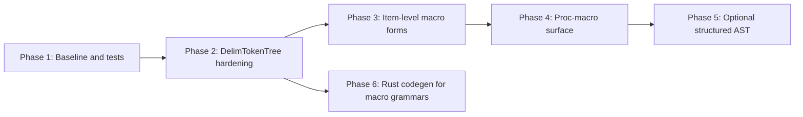

# Rust Macro Support — Implementation Plan

This document plans extensions to **Rust-as-a-language in CongoCC**: the `examples/rust` grammar and the internal `org.congocc.parser.rust` bootstrap copy (`src/grammars/RustInternal.ccc`). It does **not** cover:

- **RustFormatter** (source pretty-printing of `.rs` files)
- **CTL template macros** in `src/templates/rust/*.ctl`

---

## Current State

The Rust grammar already implements a **pragmatic, token-soup** model for macros. That is appropriate for parsing real `.rs` files and building an AST, but not for macro expansion.

| Area | Status |
|------|--------|
| `macro_rules! name { ... }` | `MacroRulesDefinition` / `MacroRulesDef` |
| `path!` / `try!` invocations | `MacroInvocation` + `DelimTokenTree` |
| Item- and stmt-level `...;` | `MacroInvocationSemi` (with `SCAN` for block context) |
| Attribute bodies `#[attr(...)]` | `AttrInput` → `DelimTokenTree` |
| Macro body tokens | `AnyToken` inside `DelimTokenTree` |
| Delimiter balancing | `INJECT PARSER_CLASS` fields + `ASSERT` / `SCAN` in `DelimTokenTree` |

Relevant productions in `examples/rust/Rust.ccc`:

```text
MacroInvocation: ("try"| SimplePath) "!" =>|+1 DelimTokenTree ;

MacroInvocationSemi :
   SCAN 3
   MacroInvocation
   [SCAN 0 {endDelim != RBRACE} => ";"]
;

INJECT PARSER_CLASS : {
    private TokenType startDelim, endDelim, mostNestedDelim;
    private int parenthesisNesting, bracketNesting, braceNesting, delimNesting;
}

DelimTokenTree : ... delimiter nesting with ASSERT ...

MacroRulesDefinition : 'macro_rules'  "!" Identifier =>|+1 MacroRulesDef ;
```

**Test corpus:** `examples/rust/testfiles/` includes macro-heavy files (`assertions.rs`, `join.rs`, `derive_action.rs`, `propagate_stability.rs`, etc.). `RParse` is the regression harness.

**Explicitly out of scope today:** macro expansion, name resolution, proc-macro execution, or a full `macro_rules` matcher/transcriber AST.

---

## Goals and Non-Goals

### Goals

- Parse macro syntax commonly found in real crates (builtins, `macro_rules!`, attributes, nested delimiters).
- Maintain **one grammar** (`examples/rust/Rust.ccc`) shared by the public parser and `RustInternal.ccc`.
- Grow a **macro-focused regression suite** with clear pass/fail expectations.

### Non-Goals

- Macro expansion or hygiene.
- Full rustc compatibility on every edge case.
- Structured metavar/transcriber trees (unless an LSP or tooling need appears later).

---

## Gap Analysis

### A. Grammar / Lexer Gaps

| Gap | Why it matters | Suggested direction |
|-----|----------------|-------------------|
| `macro name { ... }` item (non-`macro_rules`) | Modern / alternate item form | New `MacroItem` production under `Item` |
| `pub macro` / visibility on macros | Module-level exports | Extend `Item` / visibility like `macro_rules` |
| Builtin `ident!` without path | `println!`, `vec!`, `concat!` | Already works via `SimplePath` + one segment; add tests |
| `::path::to::mac!` | Crate-root macros | Covered; add `pub(crate)::` / `$crate` tests |
| Nested `macro_rules!` in macro bodies | e.g. `join.rs`-style `doc! { macro_rules! ... }` | Stress-test `DelimTokenTree` nesting |
| Edition / new tokens in macro bodies | New keywords in macro soup | Extend `AnyToken` when lexer adds tokens |
| `VisItem` vs `Item` macro placement | Macros at `Item`, not inside `VisItem` | Confirm `AssociatedItem` cases; extend if needed |
| Comments inside token trees | `DelimTokenTree` uses `AnyToken`, not comments | Decide: allow `LINE_COMMENT` in `AnyToken` or document limitation |

### B. Parser Implementation Gaps (Java Generated Parser)

| Gap | Why it matters |
|-----|----------------|
| `DelimTokenTree` relies on **Java INJECT** (`startDelim`, `endDelim`, `getTokenType`, etc.) | Fine for Java target; internal parser and `RParse` depend on it |
| `SCAN {endDelim != RBRACE}` in `MacroInvocationSemi` | Block vs item semicolon disambiguation — fragile; needs golden tests |
| `mostNestedDelim` injected but lightly used | Audit or remove dead state |

### C. Cross-Cutting: `-lang rust` Codegen (Optional)

Generating `Rust.ccc` with `-lang rust` requires translating `DelimTokenTree` semantic actions and `INJECT PARSER_CLASS` into Rust (`RustTranslator` + `parser.rs.ctl`). That is **not** required for parsing Rust with Java, but **is** required for a self-hosted Rust parser. Treat as a **later track**, not Phase 1.

---

## Recommended Phases



### Phase 1 — Baseline and Macro Test Matrix

1. Run `RParse` on `testfiles/` and tag **macro-related failures** (file + line).
2. Add `examples/rust/testfiles/macros/` with minimal cases:
   - `macro_rules!` with `$(...)`, `*`, `+`, `?`
   - `println!`, `vec!`, `format!`, `include_str!`
   - `crate::mac!`, `$crate::mac!`
   - `#[derive(Foo)]`, `#[proc_macro_derive(Bar)]` (parse-only)
   - Nested `macro_rules` inside another macro body (e.g. `join.rs` style)
3. Document briefly in `examples/rust/` (or this doc): what parses, what is token soup.

**Exit criteria:** Known pass/fail list; no regressions on existing corpus.

### Phase 2 — Harden `DelimTokenTree`

1. Review nesting logic against rustc-style cases: `fn f() { vec![mac!(a { b })]; }`, unbalanced recovery messages.
2. Extend `AnyToken` for any lexer token missing from the large alternation (compare edition keywords vs `RustLexer.ccc`).
3. Add tests for `MacroInvocationSemi` `SCAN`:
   - macro stmt at end of block (no `;`)
   - macro stmt in item list (with `;`)
   - macro inside `match` arm
4. Optional: allow **line comments** inside delimiter trees if failures show `//` in `macro_rules!` bodies breaking parse.
5. Regenerate `org/parsers/rust` and internal `org.congocc.parser.rust`; run formatter tests if layout changes matter.

**Exit criteria:** Macro subdirectory green in `RParse`; `join.rs` / `assertions.rs` stable.

### Phase 3 — Item-Level Macro Forms

1. Add production for **`macro` item** (parallel to `MacroRulesDefinition`), aligned with the [Rust reference — Macros](https://doc.rust-lang.org/reference/items/macros.html) for the target edition.
2. Wire into `Item` (and `AssociatedItem` if the reference allows).
3. Tests: `pub macro`, `macro m {}`, interaction with `macro_export` attribute (attribute path already parses via `OuterAttribute`).

**Exit criteria:** New item form parses; no conflict with `macro` keyword in `AnyToken`.

### Phase 4 — Proc-Macro and Attribute Surface (Parse-Only)

1. Confirm attribute forms parse: `#[proc_macro]`, `#[proc_macro_derive(Trait)]`, `#[proc_macro_attribute]`.
2. Add tests from `derive_action.rs`, `dynamic_spacing.rs` (`use proc_macro::...`).
3. Do **not** model `TokenStream` AST unless a consumer needs it.
4. Document: `extern crate` proc-macro crates parse as normal items.

**Exit criteria:** Proc-macro **syntax** in test corpus parses; expansion remains out of scope.

### Phase 5 — Optional Structured `macro_rules` AST (Later)

Only if tooling (e.g. congocc-lsp) needs it:

- Split `MacroRulesDef` into `Matcher` / `Transcriber` / `MacroRule` nodes instead of flat `DelimTokenTree`.
- High effort, rustc-level complexity; defer until a concrete consumer exists.

### Phase 6 — Rust Codegen for Macro-Heavy Grammars (Parallel / Later)

If the goal includes `java -jar congocc.jar -lang rust examples/rust/Rust.ccc`:

1. Extend `RustTranslator` for parser-action idioms in `DelimTokenTree`:
   - `getTokenType(0)` → `self.current_token_type()` (or equivalent)
   - `TokenType.LPAREN` → `TokenType::LPAREN`
   - `switch` → `match`
2. Map `INJECT PARSER_CLASS` fields via `getParserFieldStructFields` (extend for `TokenType` if needed).
3. Consider `#if !__rust__` / Rust-native `INJECT` for `DelimTokenTree` only (see `src/templates/rust/FIXME.md.ctl`).
4. CI: `ant -Drust.enabled=true test-rust` including generate-from-`Rust.ccc` + `cargo check`.

**Exit criteria:** Rust-generated parser compiles and parses the macro test matrix.

---

## Ownership Split

| Track | Primary files |
|-------|----------------|
| Grammar | `examples/rust/Rust.ccc`, `RustLexer.ccc` |
| Tests | `examples/rust/testfiles/macros/`, `RParse.java` |
| Java parser regen | `examples/rust/build.xml`, `src/grammars/RustInternal.ccc` |
| Rust codegen (Phase 6) | `RustTranslator.java`, `src/templates/rust/parser.rs.ctl`, `inject.rs.ctl` |
| LSP (future) | congocc-lsp — macro node kinds, not expansion |

---

## Success Criteria (Checklist)

- [ ] `ant test` in `examples/rust` passes on macro subdirectory + existing corpus.
- [ ] `macro_rules!`, `path!`, stmt/item macros, and `#[attr(...)]` bodies parse with balanced delimiters.
- [ ] `macro` item form (Phase 3) covered if targeting current Rust editions.
- [ ] Limitations documented: no expansion; token trees may omit comments unless Phase 2 adds them.
- [ ] (Optional) `-lang rust` build of `Rust.ccc` passes `cargo check`.

---

## Suggested First PR

**“Macro test corpus + DelimTokenTree hardening”** — Phase 1 + Phase 2 only: no new item syntax, no structured AST, no Rust codegen. Highest value for parsing real code with lowest risk.

Phase 3 (`macro` items) is the highest-impact grammar addition after that. Phase 6 matters only when bootstrapping a Rust parser, not when parsing Rust from Java.

---

## Time Estimates

Phase durations (e.g. Phase 1: 1–2 days, Phase 2: 3–5 days) are **rough human-developer-day estimates** for an experienced developer familiar with CongoCC — backlog sizing, not a schedule commitment.

They are **not**:

- **Pure agent time** — wall-clock with an agent varies with review, CI, and design decisions.
- **Fixed calendar time** with a specific human/agent pairing unless you define one.

| Interpretation | Typical effect |
|------------------|----------------|
| Experienced dev, full focus | Closest to stated ranges |
| Human + agent (agent drafts, human reviews) | Often shorter wall-clock for drafting; similar total time to “done” including review and regen |
| Agent alone, minimal human | Unpredictable on `DelimTokenTree` / `SCAN` without sign-off |
| Part-time calendar | Multiply by 2–4× |

Rescale after choosing a workflow (e.g. “agent implements, I review” vs. “I implement with agent help”).

---

## Related Documents

- [rust_plan.md](rust_plan.md) — Rust code generation (`-lang rust`) implementation plan
- [CLAUDE.md](../CLAUDE.md) — project overview and Rust target overview
